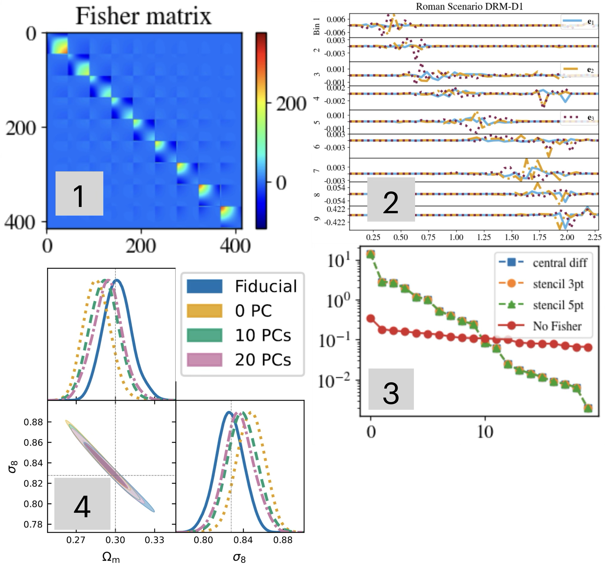

# PCA model for n(z)  
Any questions, please contact me.

<!--  -->
[](results/figures/readme_figures/readme_figure.png)

## Introduction  
The PCA model for n(z) is described in the paper 2506.00758 developed for DES Y6 using [CosmoSIS](https://cosmosis.readthedocs.io/en/latest/). The pipeline cocoa_photoz implement new codes and modify some of [CoCoA](https://github.com/CosmoLike/cocoa)'s codes to, in a general view: *(i)* find the Fisher matrix, $F$, *(ii)* find the principal components (or modes), $\mathrm{e}_i(z)$, and its associated amplitudes, $\alpha_i$, and *(iii)* provide `yaml` files to run MCMCs with this PCA model of the redshift distribution $n(z)=\bar{n}(z)+\sum\alpha_i\mathrm{e}_i(z)$. Several intermediate steps and validation process are necessary to accomplish these three general milestones, which are explained in the paper 1234.5678. As a case of study, this new photo-z mitigation approach is applied to Roman High Latitude Wide Area Survey.     

## Setup   
0) Clone cocoa by following stepts at https://github.com/CosmoLike/cocoa   
At this development stage of cocoa_photoz, this step is recommended in order to not messy up with your current projects and possible cocoa's modifications.        
1) `cd cocoa/Cocoa`
2) `git clone git@github.com:diogohf/cocoa_photoz.git`   
3) The PCA model for n(z) requires modifications of some cocoa's scripts. We manage this by coping and pasting the following files into the Roman Real folders likelihood, interface, and data:  
    `cp cocoa_photoz/modifications/roman_real/likelihood/* projects/roman_real/likelihood/`  
    `cp cocoa_photoz/modifications/roman_real/interface/* projects/roman_real/interface/`  
    `cp -r cocoa_photoz/modifications/roman_real/data/* projects/roman_real/data/`  
4) Decompress the covariance matrix: `gunzip projects/roman_real/data/sc1bd4/cov_sc1bd4r0.gz`
5) `conda activate cocoa ; source start_cocoa.sh`  
6) Compile Roman Real: `source projects/roman_real/scripts/compile_roman_real.sh`   

## Minimal Example
### 1 - The Fisher matrix of cosmic shear  
The Fisher matrix is given by Eq. 6 of 2506.00758 and requires to have the covariance matrix (found with [CosmoCov](https://github.com/CosmoLike/CosmoCov) and provided beforehand) and the Jacobian matrix of the cosmic shear two-point correlation functions $\xi^{ij}_\pm(\theta)$. The folder `cocoa_photoz/modifications/roman_real/likelihood/` constains the core scripts for this task. The derivatives methods are in the code `nz_pca.py` which is imported by `_cosmolike_prototype_base.py`. To find the Fisher matrix, it is necessary to run an single CoCoA's evaluation with [Cobaya](https://cobaya.readthedocs.io/en/latest/#). Yaml files for this task are provided at `cocoa_photoz/yamls/roman_pca/roman_fisher_RR/` with `NZ_EVALUATE{i}.yaml`. On an HPC, a single likelihood evaluation usually took less than 1 second, and may be performed on the login node for quick tests, but here the evaluation is used to compute the Fisher matrix and we suggest to use the compute node. The exact computaional time will depends on the number of tomographic bins, $N_t$, and the number of redshift points, $N_z$, per tomographic bins. In the case of study here with $N_t=9$ and $N_z=46$ the typical time is 1.22 minutes. The standard numerical differentiation we use here is the [5-point stencil](https://en.wikipedia.org/wiki/Five-point_stencil), which also is implemented in CosmoSIS, see e.g. [fisher sampler](https://cosmosis.readthedocs.io/en/latest/reference/samplers/fisher.html). In practice you need to modify `cocoa_photoz/sh/fisher.sh` to adapt to your HPC specifications, and then run  
```
(.local) (cocoa) {username}@{hostname}:Cocoa$ sbatch --array=0 cocoa_photoz/sh/fisher.sh
```
to run `NZ_EVALUATE0.yaml`. This will save the Fisher matrix at `./jacobian_outs` under the name `fisher_matrix_{step_size}.txt`, where `step_size` is the step size parameter value used in the finite difference method to find the Jacobian matrix. As exploratory tests, you may want to change the parameter `step_size` or run the other provided yaml files `NZ_EVALUATE{i}.yaml` for this exercise.

### 2 - Principal components and amplitudes
Once the Fisher matrix have been found, we can proceed to find its principal components $\mathrm{e}_i(z)$ and its corresponding amplitudes $\alpha_i$. Extensive examples are in the notebook `cocoa_photoz/codes/example.ipynb`. [TODO: create a dedicated Python script to take the Fisher matrix and produce the principal components.] The principal components are automatically saved at `projects/roman_real/data/sc1bd4/U_fisher.txt`. 
```
(.local) (cocoa) {username}@{hostname}:Cocoa$ python cocoa_photoz/codes/{TODO.py}
```
CoCoA recognize these PCs by passing the file name `U_fisher.txt` to the `.dataset` configuration file, just in the same way as the baryon PCs.
### 3 - Running MCMC with PCA model for n(z)
Run a MCMC with this new photo-z bias mitigation method just requires adding extra parameter to the yaml file: the desired number of PCs, `npcs_nz`, and the priors on the PCs amplitudes, e.g. `roman_alpha_1` . Examples are provided at `cocoa_photoz/yamls/roman_pca/MCMC{i}.yaml`. To run an MCMC just do: 
```
(.local) (cocoa) {username}@{hostname}:Cocoa$ sbatch --array=2 cocoa_photoz/sh/roman_force_mcmc.sh
```
to run `MCMC2.yaml`, the simplest example with just one PC amplitude.

OBS: These three steps cover the essential aspects of `cocoa_photoz`. Below are additional examples to further explore the PCA model of $n(z)$ and in order to compare with the standard "shift" parameter $n(z)\rightarrow n(z-\Delta_z)$.

## Further MCMCs examples with PCA model for n(z):  
MCMC index / Roman scenario / realization index / chain status (NS=Not Started, R=Running, C=Converged)    

Setup: No PC & No Shift. Synthetic data vector: ξ±(nz_fid = nz_991213). Model: ξ±(nz = nz_fid)  
57         / sc1bd4         / 991213            / NS        
Setup: No PC & Shift. Synthetic data vector: ξ±(nz_fid = nz_991213). Model: ξ±(nz = nz_bar)  
59         / sc1bd4         / 991213            / NS        
Setup: 5 PC & No Shift. Synthetic data vector: ξ±(nz_fid = nz_991213). Model: ξ±(nz = nz_bar + α_1 * PC_1 +...+ α_5 * PC_5).
69         / sc1bd4         / 991213            / NS        
Setup: 10 PC & No Shift. Synthetic data vector: ξ±(nz_fid = nz_991213). Model: ξ±(nz = nz_bar + α_1 * PC_1 +...+ α_10 * PC_10).
79         / sc1bd4         / 991213            / NS        

PS: nz_bar is the mean n(z) of 1 million realization of the scenario sc1bd4  

Analyzing the minimal MCMC example with PCA model for n(z):  
```
(.local) (cocoa) {username}@{hostname}:Cocoa$ python cocoa_photoz/codes/minimal_example.py  
```
You be able to reproduce the constraints on Ωm, σ8 and the α_{1...10}.  
Compare your results with the figures triangle_plot_10pc_reference.pdf and triangle_plot_reference.pdf at cocoa_photoz/codes/minimal_example/